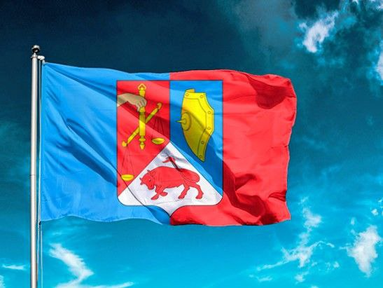
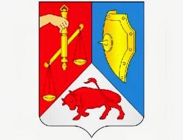
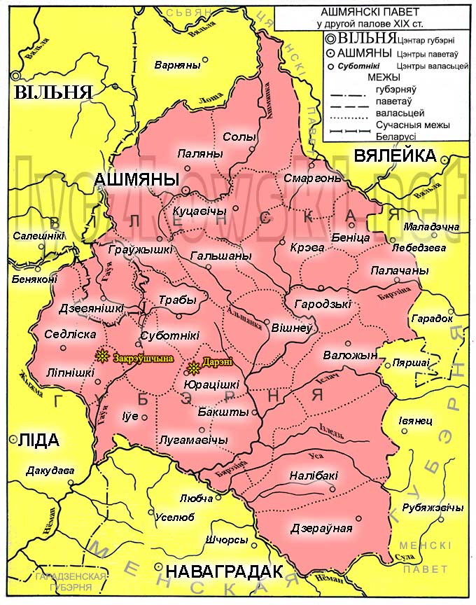
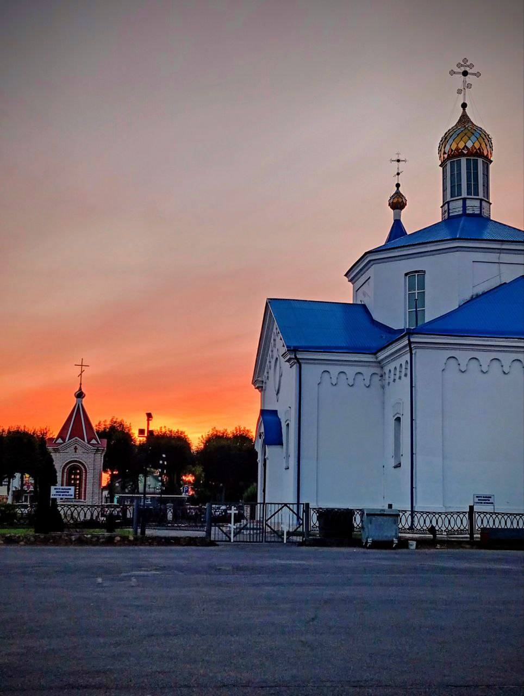
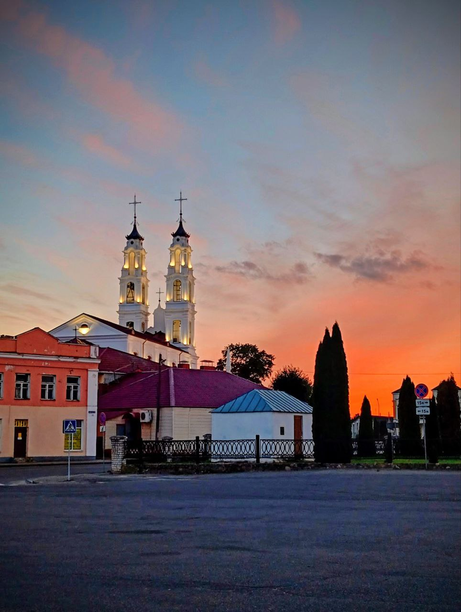
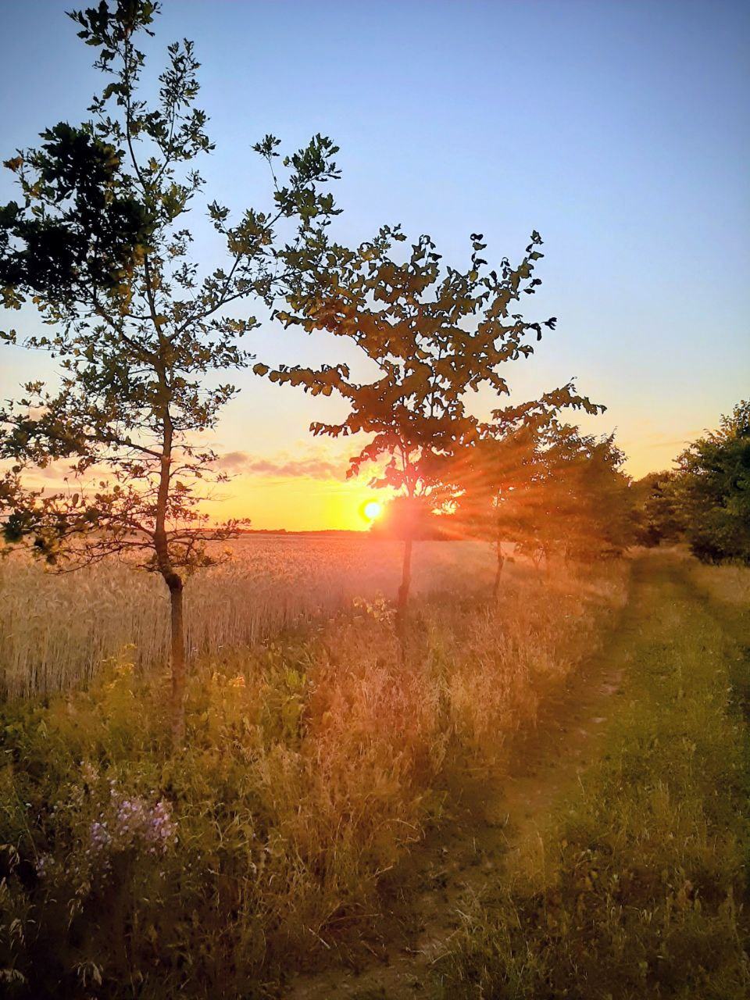
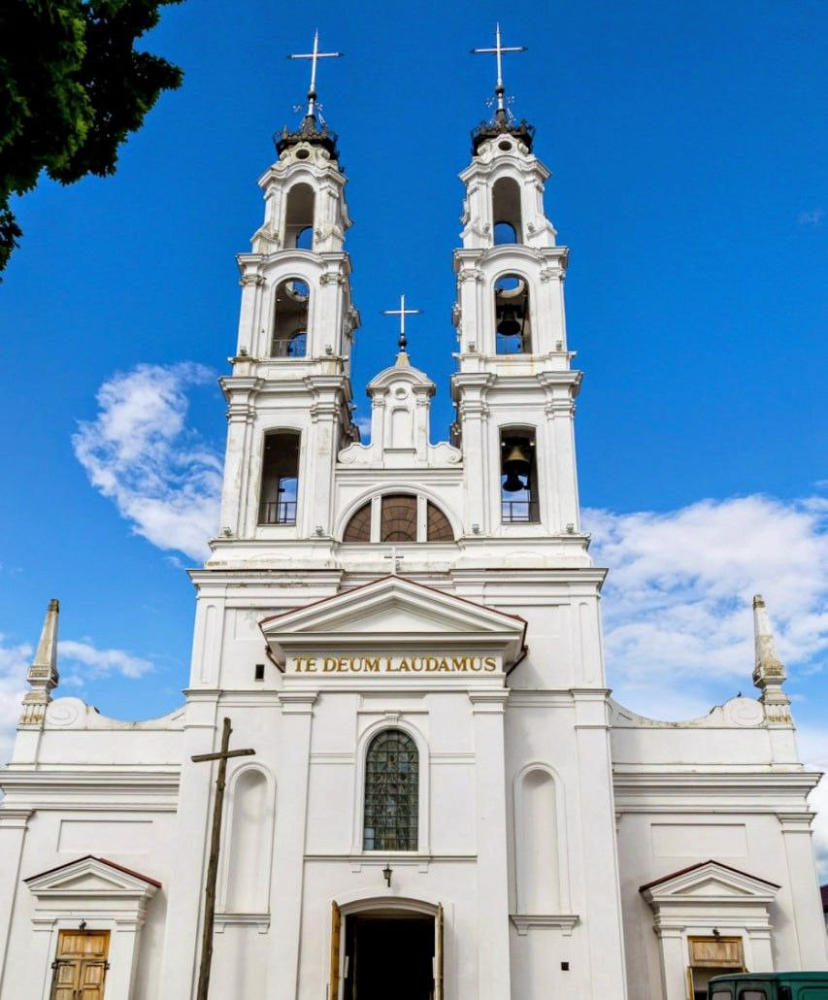

<!doctype html>
<html lang="ru">
<head>
    <meta charset="UTF-8">
    <title>Город Ошмяны</title>
    
</head>
<body>

    <!-- Панель навигации -->
    

        <button class="nav-btn" onclick="location.href='cats.html'">Котики</button>
        <button class="nav-btn active" onclick="location.href='city.html'">Мой город</button>
    

    

      <h1>Ошмяны всегда в моем сердце</h1>
      

      <!-- 1. История города -->
      <h2>История города</h2>
      

          Ошмяны — один из древнейших городов Гродненской области. Первое упоминание относится к 14 веку. 
          Город был важным торговым и культурным центром, неоднократно разрушался во время войн, но каждый раз возрождался.
      

      

      <!-- 2. Достопримечательности -->
      <h2>Достопримечательности</h2>
      <ul>
          <li>Костёл Святого Михаила Архангела</li>
          <li>Руины замка в Старых Ошмянах</li>
          <li>Воскресенская церковь</li>
          <li>Ошмянский краеведческий музей</li>
          <li>Собственное производство кофе</li>
      </ul>
      

      <!-- 3. Символы города -->
      <h2>Символы города</h2>
      
<strong>Герб:</strong> Французский щит с вилообразным делением: рука с весами, золотой щит и красный теленок.

      
      
<strong>Флаг:</strong> Полотнище 1:2, разделённое пополам (голубая и красная части), с гербом в центре.

      
      

      <!-- 4. Расположение на карте -->
      <h2>Расположение на карте</h2>
      
Город Ошмяны находится в северо-восточной части Гродненской области.

      
      

      <!-- 5. Новости -->
      <h2>Новости</h2>
      <ul>
          <li><a href="https://oshmiany.gov.by" target="_blank">Официальный сайт Ошмянского района</a></li>
          <li><a href="https://grodnonews.by" target="_blank">Новости региона</a></li>
      </ul>
      

      <!-- 6. Город сейчас -->
      <h2>Город сейчас</h2>
      

          Сегодня Ошмяны — это современный город с развивающейся промышленностью и сельским хозяйством. 
          Здесь работают предприятия пищевой, строительной и деревообрабатывающей промышленности, 
          развита сеть образовательных и культурных учреждений.
      

      

       
      
      
       
      

      

      <!-- 7. Дополнительная информация -->
      <h2>Интересные факты</h2>
      <ol>
          <li>В 20 км от города стоит Гольшанский замок — теперь величественные руины, о которых ходят легенды.</li>
          <li>На Вербное воскресенье в городе проходит крестный ход на Святую гору — «Ошмянскую Голгофу».</li>
      </ol>
      
<strong>Я люблю свой город, ведь здесь история переплетается с современностью!</strong>

    

    <footer>
        
&copy; 2025 Мой сайт про Ошмяны

    </footer>
</body>
</html>
